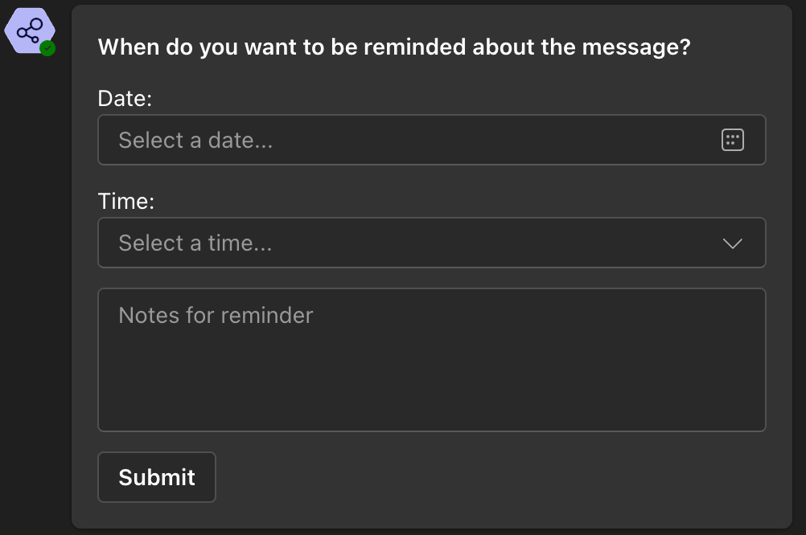
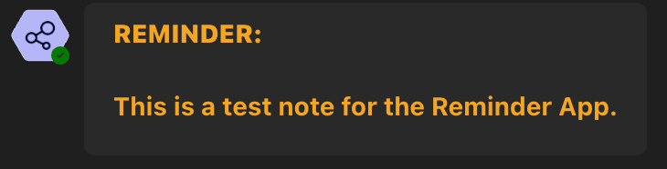
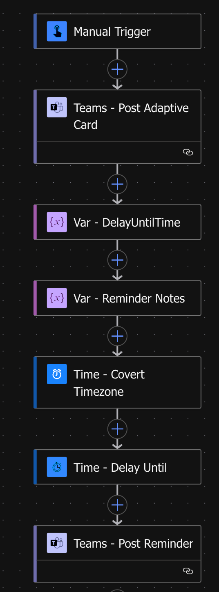

# Teams Reminder App

## Overview
MS Teams Reminder App is a simple and efficient tool designed to help users stay organized and on track within Microsoft Teams. With this app, you can set custom reminders that are delivered directly to your Teams chat at the scheduled time — no need to rely on external apps or calendars.

## Use Case
- Personal task reminders
- Meeting prep notifications

## Flow Overview

## Change Logs

Version |Date              |Comments
--------|------------------|--------------------------------
1.0     |May 12, 2025 |Initial release

## Disclaimer
**THIS CODE IS PROVIDED *AS IS* WITHOUT WARRANTY OF ANY KIND, EITHER EXPRESS OR IMPLIED, INCLUDING ANY IMPLIED WARRANTIES OF FITNESS FOR A PARTICULAR PURPOSE, MERCHANTABILITY, OR NON-INFRINGEMENT.**

